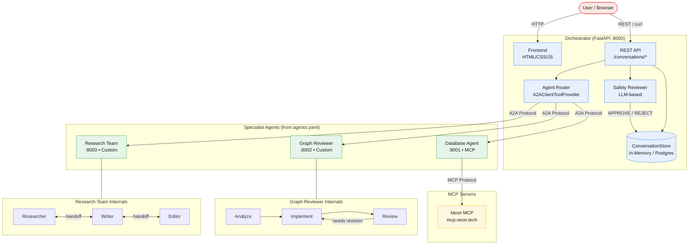
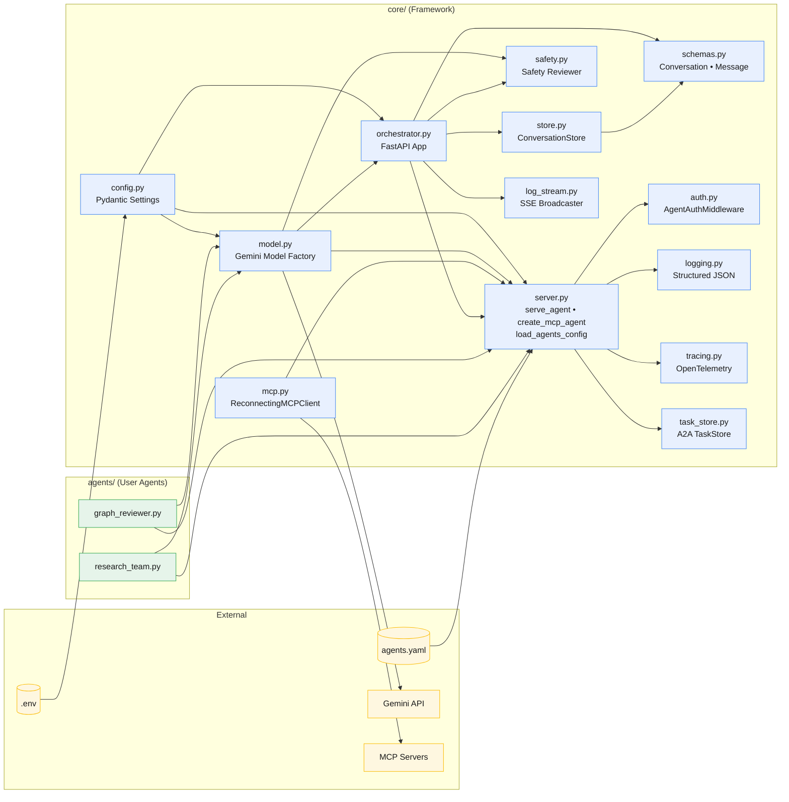
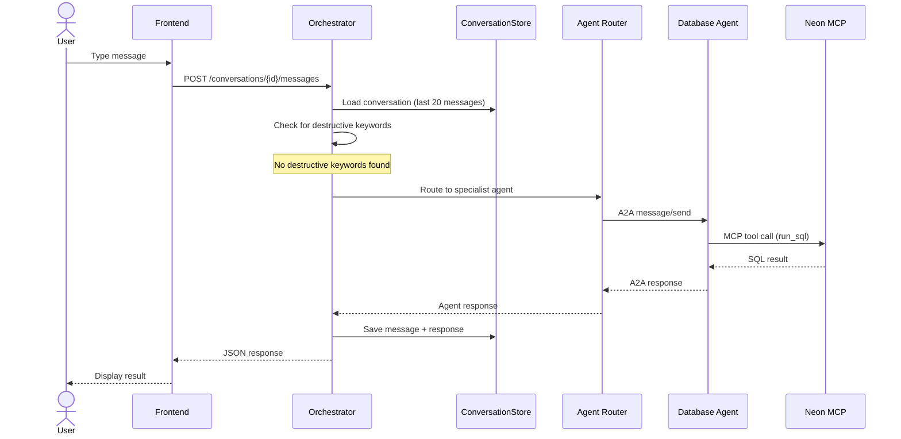
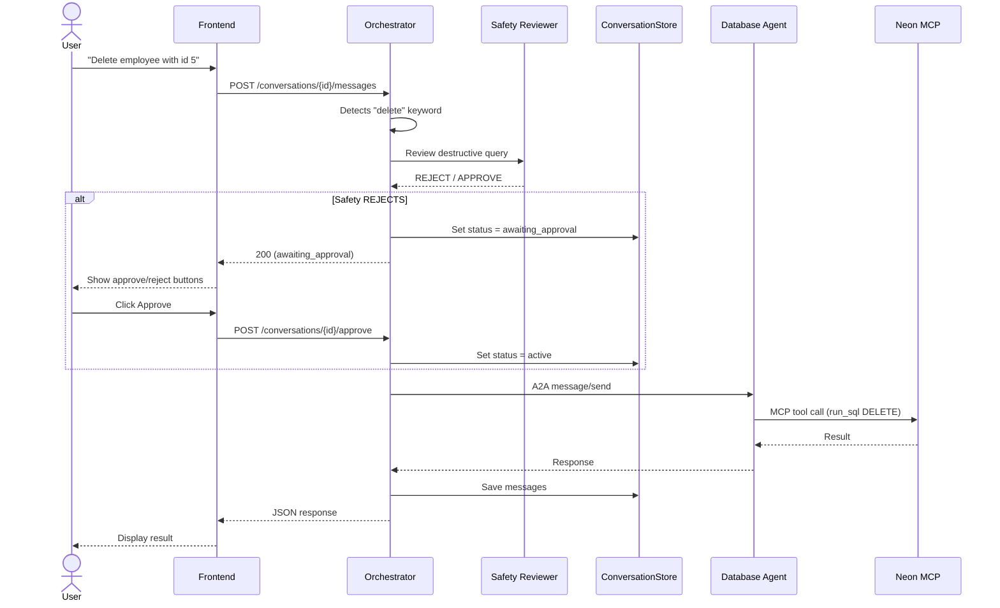

# Architecture

## System Architecture

```mermaid
graph TB
    User([User / Browser])

    subgraph Orchestrator ["Orchestrator (FastAPI :8000)"]
        FE[Frontend<br/>HTML/CSS/JS]
        API[REST API<br/>/conversations/*]
        Safety[Safety Reviewer<br/>LLM-based]
        Store[(ConversationStore<br/>In-Memory / Postgres)]
        Router[Agent Router<br/>A2AClientToolProvider]
    end

    subgraph Agents ["Specialist Agents (from agents.yaml)"]
        direction TB
        DB[Database Agent<br/>:8001 &bull; MCP]
        GR[Graph Reviewer<br/>:8002 &bull; Custom]
        RT[Research Team<br/>:8003 &bull; Custom]
    end

    subgraph MCP_Servers ["MCP Servers"]
        Neon[Neon MCP<br/>mcp.neon.tech]
    end

    subgraph Graph ["Graph Reviewer Internals"]
        direction LR
        Analyze[Analyze] --> Implement[Implement] --> Review[Review]
        Review -->|needs revision| Implement
    end

    subgraph Swarm ["Research Team Internals"]
        direction LR
        Researcher[Researcher] <-->|handoff| Writer[Writer] <-->|handoff| Editor[Editor]
    end

    User -->|HTTP| FE
    User -->|REST / curl| API
    API --> Safety
    Safety -->|APPROVE / REJECT| Store
    API --> Store
    API --> Router
    Router -->|A2A Protocol| DB
    Router -->|A2A Protocol| GR
    Router -->|A2A Protocol| RT
    DB -->|MCP Protocol| Neon
    GR --- Graph
    RT --- Swarm

    classDef framework fill:#e8f0fe,stroke:#4285f4,color:#1a1a1a
    classDef agent fill:#e6f4ea,stroke:#34a853,color:#1a1a1a
    classDef external fill:#fef7e0,stroke:#fbbc04,color:#1a1a1a
    classDef user fill:#fce8e6,stroke:#ea4335,color:#1a1a1a

    class User user
    class FE,API,Safety,Store,Router framework
    class DB,GR,RT agent
    class Neon external
```

## Component Diagram

```mermaid
graph LR
    subgraph core ["core/ (Framework)"]
        config[config.py<br/>Pydantic Settings]
        model[model.py<br/>Gemini Model Factory]
        server[server.py<br/>serve_agent &bull; create_mcp_agent<br/>load_agents_config]
        mcp[mcp.py<br/>ReconnectingMCPClient]
        orch[orchestrator.py<br/>FastAPI App]
        safety[safety.py<br/>Safety Reviewer]
        schemas[schemas.py<br/>Conversation &bull; Message]
        store[store.py<br/>ConversationStore]
        auth[auth.py<br/>AgentAuthMiddleware]
        logging_mod[logging.py<br/>Structured JSON]
        tracing[tracing.py<br/>OpenTelemetry]
        task_store[task_store.py<br/>A2A TaskStore]
        log_stream[log_stream.py<br/>SSE Broadcaster]
    end

    subgraph agents ["agents/ (User Agents)"]
        graph_rev[graph_reviewer.py]
        research[research_team.py]
    end

    subgraph ext ["External"]
        yaml[(agents.yaml)]
        env[(.env)]
        gemini[Gemini API]
        mcp_srv[MCP Servers]
    end

    config --> model
    config --> server
    config --> orch
    model --> server
    model --> orch
    model --> safety
    mcp --> server
    server --> auth
    server --> logging_mod
    server --> tracing
    server --> task_store
    orch --> safety
    orch --> store
    orch --> schemas
    orch --> log_stream
    orch --> server
    store --> schemas

    graph_rev --> model
    graph_rev --> server
    research --> model
    research --> server

    yaml --> server
    env --> config
    model --> gemini
    mcp --> mcp_srv

    classDef fw fill:#e8f0fe,stroke:#4285f4,color:#1a1a1a
    classDef usr fill:#e6f4ea,stroke:#34a853,color:#1a1a1a
    classDef ext_cls fill:#fef7e0,stroke:#fbbc04,color:#1a1a1a

    class config,model,server,mcp,orch,safety,schemas,store,auth,logging_mod,tracing,task_store,log_stream fw
    class graph_rev,research usr
    class yaml,env,gemini,mcp_srv ext_cls
```

## Data Flow: Normal Query

```mermaid
sequenceDiagram
    actor User
    participant FE as Frontend
    participant Orch as Orchestrator
    participant Store as ConversationStore
    participant Router as Agent Router
    participant Agent as Database Agent
    participant MCP as Neon MCP

    User->>FE: Type message
    FE->>Orch: POST /conversations/{id}/messages
    Orch->>Store: Load conversation (last 20 messages)
    Orch->>Orch: Check for destructive keywords
    Note over Orch: No destructive keywords found
    Orch->>Router: Route to specialist agent
    Router->>Agent: A2A message/send
    Agent->>MCP: MCP tool call (run_sql)
    MCP-->>Agent: SQL result
    Agent-->>Router: A2A response
    Router-->>Orch: Agent response
    Orch->>Store: Save message + response
    Orch-->>FE: JSON response
    FE-->>User: Display result
```

## Data Flow: Destructive Query (Safety Review)

```mermaid
sequenceDiagram
    actor User
    participant FE as Frontend
    participant Orch as Orchestrator
    participant Safety as Safety Reviewer
    participant Store as ConversationStore
    participant Agent as Database Agent
    participant MCP as Neon MCP

    User->>FE: "Delete employee with id 5"
    FE->>Orch: POST /conversations/{id}/messages
    Orch->>Orch: Detects "delete" keyword
    Orch->>Safety: Review destructive query
    Safety-->>Orch: REJECT / APPROVE

    alt Safety REJECTS
        Orch->>Store: Set status = awaiting_approval
        Orch-->>FE: 200 (awaiting_approval)
        FE-->>User: Show approve/reject buttons
        User->>FE: Click Approve
        FE->>Orch: POST /conversations/{id}/approve
        Orch->>Store: Set status = active
    end

    Orch->>Agent: A2A message/send
    Agent->>MCP: MCP tool call (run_sql DELETE)
    MCP-->>Agent: Result
    Agent-->>Orch: Response
    Orch->>Store: Save messages
    Orch-->>FE: JSON response
    FE-->>User: Display result
```
