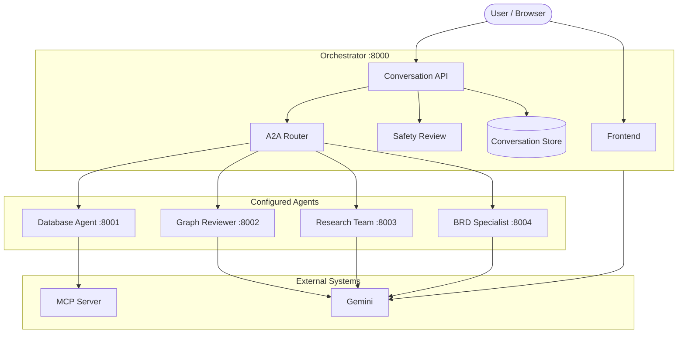
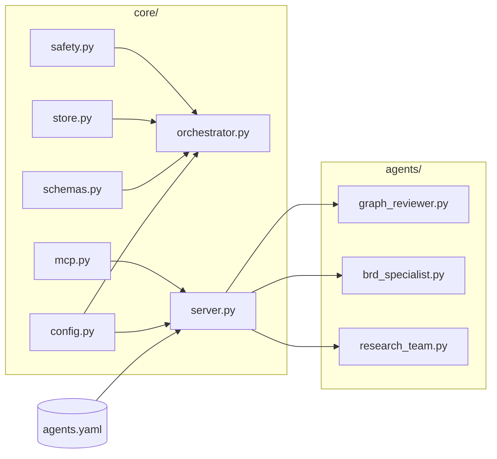
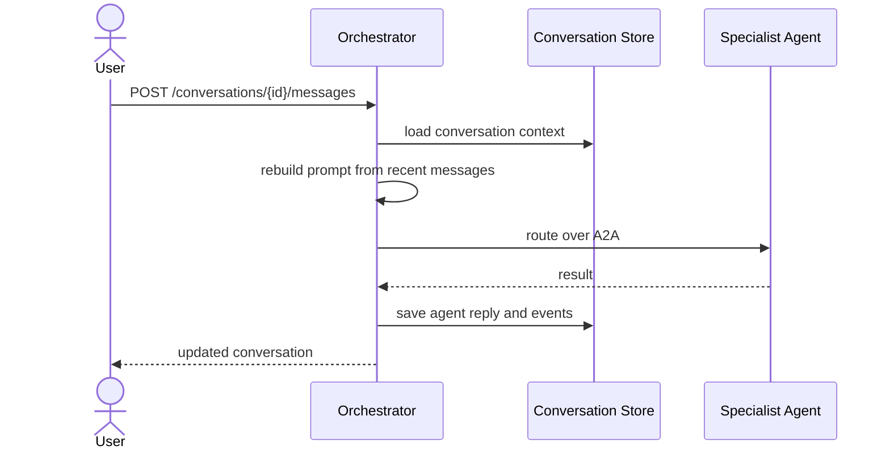
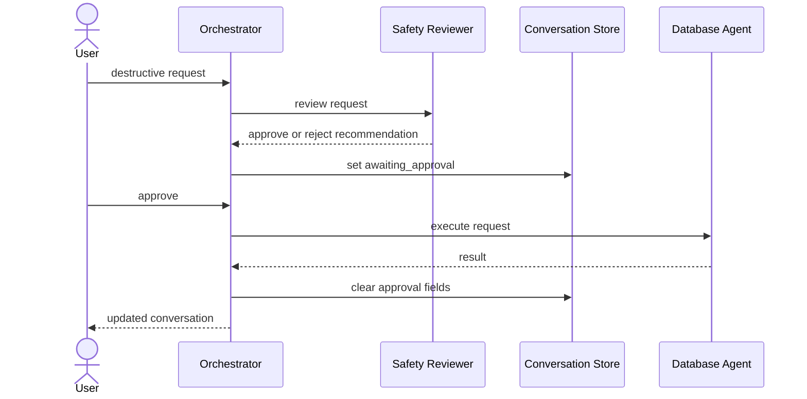
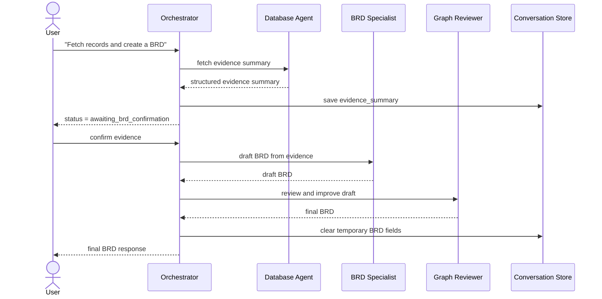

# Architecture

## System Overview

## Framework Boundary

## Startup Model

- `run_system.py` reads `agents.yaml`
- every configured agent is started through `core.server`
- `core.server` supports both `mcp` and `custom` agent entries
- the orchestrator builds its routing prompt from the same `agents.yaml`

That means `agents.yaml` is the effective runtime contract for local startup and direct agent
launches.

## Standard Request Flow

## Destructive Request Flow

## Fetch-to-BRD Flow

## Key Design Choices

- Conversation context is rebuilt per turn to avoid cross-conversation leakage.
- Approval and evidence confirmation are separate states because they solve different risks.
- Custom and MCP agents share one startup path so the framework stays configuration-driven.
- The BRD flow is staged to keep facts and assumptions separated.
