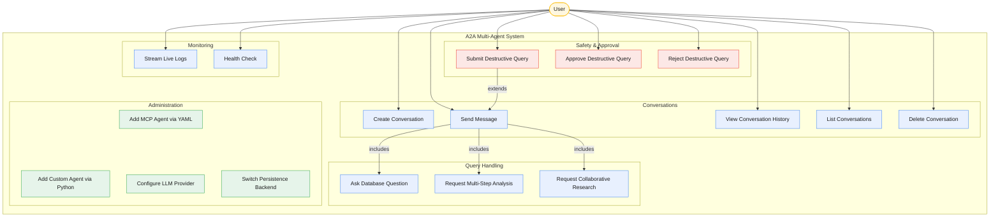

# Use Cases

## Use Case Diagram

## Use Case Details

### UC1: Create Conversation

| Field | Description |
|-------|-------------|
| **Actor** | User |
| **Trigger** | User clicks "+ New Chat" or `POST /conversations` |
| **Precondition** | System is running |
| **Flow** | 1. System creates a new Conversation with a unique ID and `active` status 2. System returns the conversation object |
| **Result** | Empty conversation ready to receive messages |

### UC2: Send Message

| Field | Description |
|-------|-------------|
| **Actor** | User |
| **Trigger** | User types a message and hits send, or `POST /conversations/{id}/messages` |
| **Precondition** | Conversation exists and status is `active` |
| **Flow** | 1. Orchestrator loads conversation context (last 20 messages) 2. Resets agent memory and rebuilds from context 3. Checks for destructive keywords 4. If destructive: routes to Safety Review (UC9) 5. If safe: routes to appropriate specialist agent via A2A 6. Saves user message and agent response to conversation |
| **Result** | Agent response displayed to user |

### UC6: Ask Database Question

| Field | Description |
|-------|-------------|
| **Actor** | User (via Send Message) |
| **Trigger** | Message content matches database-related intent |
| **Flow** | 1. Orchestrator routes to Database Agent via A2A 2. Database Agent calls Neon MCP tools (get_database_tables, describe_table_schema, run_sql) 3. MCP server executes against the database 4. Agent formats and returns results |
| **Example** | "Show me all tables in the database" |

### UC7: Request Multi-Step Analysis

| Field | Description |
|-------|-------------|
| **Actor** | User (via Send Message) |
| **Trigger** | Message requires structured multi-step reasoning |
| **Flow** | 1. Orchestrator routes to Graph Reviewer via A2A 2. Graph Reviewer executes: Analyze -> Implement -> Review 3. If review says "needs revision", loops back to Implement (max 5 iterations) 4. Returns final reviewed output |
| **Example** | "Analyze this codebase and suggest improvements" |

### UC8: Request Collaborative Research

| Field | Description |
|-------|-------------|
| **Actor** | User (via Send Message) |
| **Trigger** | Message requires multi-perspective research |
| **Flow** | 1. Orchestrator routes to Research Team via A2A 2. Researcher agent gathers information 3. Hands off to Writer agent to draft content 4. Hands off to Editor agent for review 5. Agents may hand back autonomously (max 10 handoffs) |
| **Example** | "Research the pros and cons of microservices vs monoliths" |

### UC9: Submit Destructive Query

| Field | Description |
|-------|-------------|
| **Actor** | User |
| **Trigger** | Message contains destructive keywords (DELETE, DROP, TRUNCATE, etc.) |
| **Precondition** | Conversation is `active` |
| **Flow** | 1. Orchestrator detects destructive keyword 2. Safety Reviewer LLM evaluates the query 3a. If APPROVE: query executes immediately 3b. If REJECT: conversation status set to `awaiting_approval` 4. User presented with approve/reject options |
| **Result** | Query either executes or waits for human approval |

### UC10: Approve Destructive Query

| Field | Description |
|-------|-------------|
| **Actor** | User |
| **Trigger** | User clicks "Approve" or `POST /conversations/{id}/approve` |
| **Precondition** | Conversation status is `awaiting_approval` |
| **Flow** | 1. Conversation status set to `active` 2. Original query is executed against the database via the Database Agent 3. Result saved to conversation |
| **Result** | Destructive operation completes |

### UC11: Reject Destructive Query

| Field | Description |
|-------|-------------|
| **Actor** | User |
| **Trigger** | User clicks "Reject" or `POST /conversations/{id}/reject` |
| **Precondition** | Conversation status is `awaiting_approval` |
| **Flow** | 1. Conversation status set to `active` 2. Rejection message saved to conversation 3. Original query is NOT executed |
| **Result** | Destructive operation cancelled |

### UC14: Add MCP Agent via YAML

| Field | Description |
|-------|-------------|
| **Actor** | Developer |
| **Trigger** | Need to connect a new MCP service |
| **Flow** | 1. Add entry to `agents.yaml` with name, type, port, mcp_url, auth, system_prompt 2. Set credentials in `.env` 3. Restart system (`python run_system.py`) 4. Orchestrator auto-discovers the new agent |
| **Result** | New agent available for routing, zero Python code written |

### UC15: Add Custom Agent via Python

| Field | Description |
|-------|-------------|
| **Actor** | Developer |
| **Trigger** | Need agent logic beyond MCP (graph workflows, swarms, pipelines) |
| **Flow** | 1. Create Python module in `agents/` with factory function 2. Use `serve_agent()` to handle server boilerplate 3. Register in `agents.yaml` as `type: custom` 4. Add service to `docker-compose.yml` |
| **Result** | Custom agent running as A2A server |
